# 가설 1

**: 현재 진행 중인 캠페인, 친구추천 이벤트 혜택 재설정 필요**

- 시기별 ‘친구추천’ 으로 초대된 사람들의 유입, 활성화율 낮음 확인 (데이터)
- ‘친구추천’ 이벤트로 유입된 유저가 많지만 유입->첫 구독까지의 전환율은?
- ’친구추천’ 이벤트에서 중복추천자(1명 이상 초대)로 유입된 200인의 전환율은?

## **방안 1**

**: 친구추천’ 이벤트의 혜택 재설계 필요**

- 친구추천 이벤트 내용이 무엇인가?
- 어떤 내용으로 추천 이벤트를 변경할 것인가?

### 월별 추천한 사람 추이 분석

| **referral_time** | **referrer_user_counts** |
| --- | --- |
| 2024-12 | 99 |
| 2025-01 | 110 |
| 2025-02 | 102 |
| 2025-03 | 8 |
| 2025-04 | 235 (+227) |
| 2025-05 | 481 **(+246)** |
| 2025-06 | 650 **(+169)** |
| 2025-07 | 582 **(-68)** |

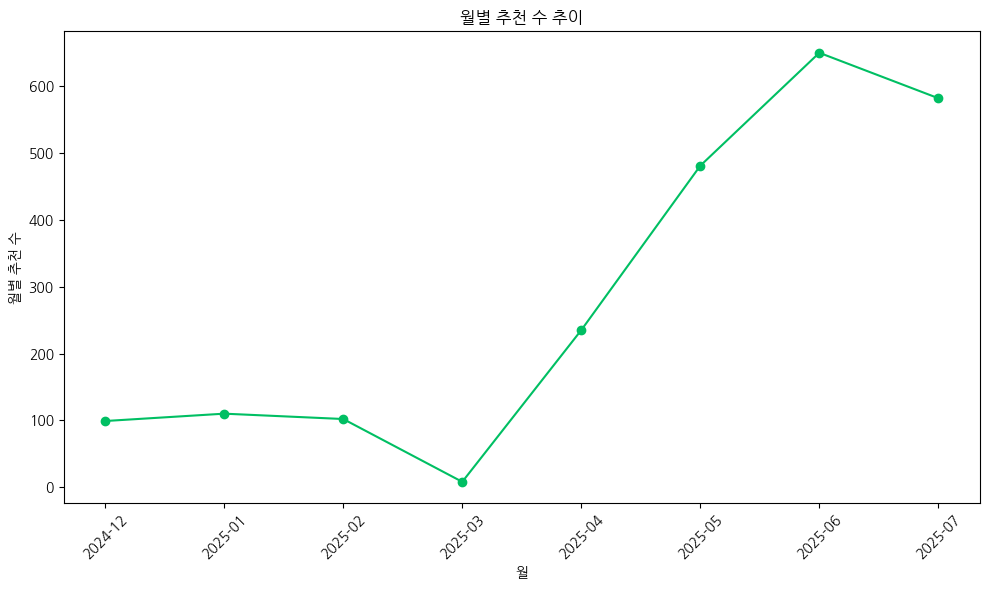

### 추천 받은 사람의 구독 상태 분석

| **plan_status** | **count** | **proportion** |  |
| --- | --- | --- | --- |
| **none** | 1068 | 0.4711071901191001 | none+trialing = 1472 |
| **trialing** | 404 | 0.17820908689898543 |  |
| **active** | 739 | 0.3259814733127481 |  |
| **canceled** | 56 | 0.024702249669166298 |  |

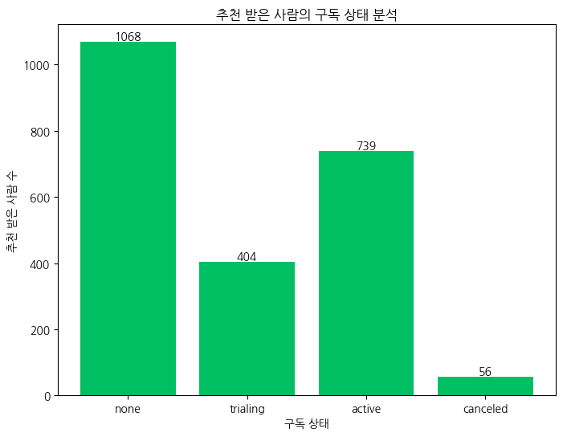

### 추천 받은 사람 중 active (결제한 사람)의 시간별 추이 분석

| **plan_start_month** | **count** |  |
| --- | --- | --- |
| 2024-12 | 47 |  |
| 2025-01 | 58 |  |
| 2025-02 | 59 |  |
| **2025-03** | **16 (-43)** | 왜 3월에 떨어졌지? |
| 2025-04 | 53 (+37) |  |
| 2025-05 | **123 (+70)** | 5월과 6월에 결제한 사람이 올라간 이유? |
| **2025-06** | **212 (+89)** |  |
| 2025-07 | 171 (-41) |  |

# 가설 2

**:  학습앱 사용법이 어려워 포기하게 된다.**

- 정말 어려워서라면 좀 더 쉽게 바꾼다면 사람들의 가입이 늘어날 것이다.
- AB테스트를 진행 이전(original)과 이후(test)를 비교 ⇒ 할당 대비 가입자의 전후 비율 변화는?
- 이전 페이지(A)로 할당된 사람들 중 구독한 사람의 비율과
    
    이후 페이지(B)로 할당된 사람들의 구독한 사람의 비율을 비교
    

## **방안 2**

**:  온보딩 튜토리얼 페이지의 유무로 A/B 테스트 하여 사람들이 비교군 사이에 결제로 가는 비율 확인**

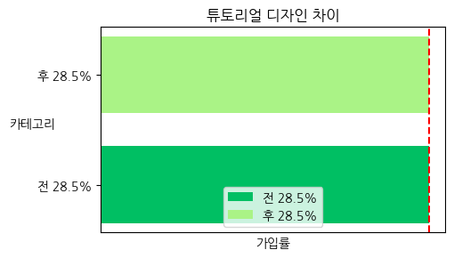

사람들이 이전과 이후의 AB테스트를 진행하여 비교한 결과 전후 28.5%로 동일하게 나왔다. ⇒ 튜토리얼 UI 문제가 아님

# 가설 3

**:  구독 요금제 페이지가 어렵다. (결제실패는x)**   

- 정말 어려워서라면 좀 더 쉽게 바꾼다면 사람들의 가입이 늘어날 것이다.
- AB테스트를 진행 이전(original)과 이후(test)를 비교 ⇒ 할당 대비 가입자의 전후 비율 변화는?
- 이전 페이지(A)로 할당된 사람들 중 구독한 사람의 비율과
    
    이후 페이지(B)로 할당된 사람들의 구독한 사람의 비율을 비교
    

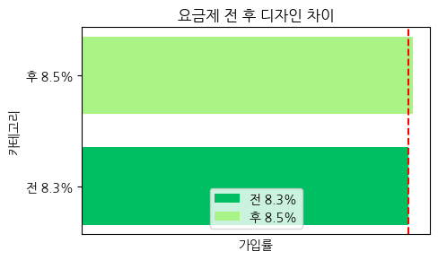

## **방안 3**

**:  구독 요금제 페이지 직관적으로 개선하기 위한 A/B 테스트 중으로 양측 중에서 어떤 구독 요금제에서 사람들의 구독률을 비교한다.** 

사람들이 이전과 이후의 AB테스트를 진행하여 비교한 결과 전 8.3%, 후 8.5%로 거의 동일하게 나와 차이가 오차범위 수준이라고 생각된다. 이에 따라 요금제 페이지가 어려워 사람들이 구독율이 떨어진다는 가정은 기각된다.  

# 가설 4

**:  구독, 가입 및 서비스 이용 관련 상담서비스의 개선 필요**

## **방안 4**

**: 카카오 상담챗을 줄이고, 웹/앱 상담채널 집중하고 개선한다.**

### 상담 채널 분포 분석

| channel | count |
| --- | --- |
| web | 572 |
| in_app | 521 |
| kakao | 521 |
| email | 511 |

### 채널별 상담 상태 분석

| channel | status | **count** |
| --- | --- | --- |
| **email** | **open** | 125 |
|  | **in_progress** | 134 |
|  | **resolved** | 125 |
|  | **closed** | 127 |
| **in_app** | **open** | 133 |
|  | **in_progress** | 137 |
|  | **resolved** | 135 |
|  | **closed** | 116 |
| **kakao** | **open** | 135 |
|  | **in_progress** | 124 |
|  | **resolved** | 123 |
|  | **closed** | 139 |
| **web** | **open** | 149 |
|  | **in_progress** | 135 |
|  | **resolved** | 142 |
|  | **closed** | 146 |

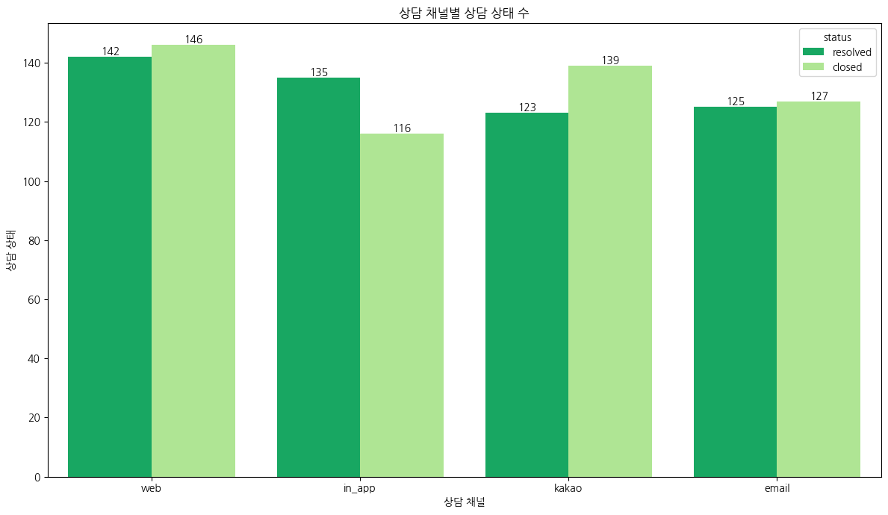

→ 비율로 체크해보자

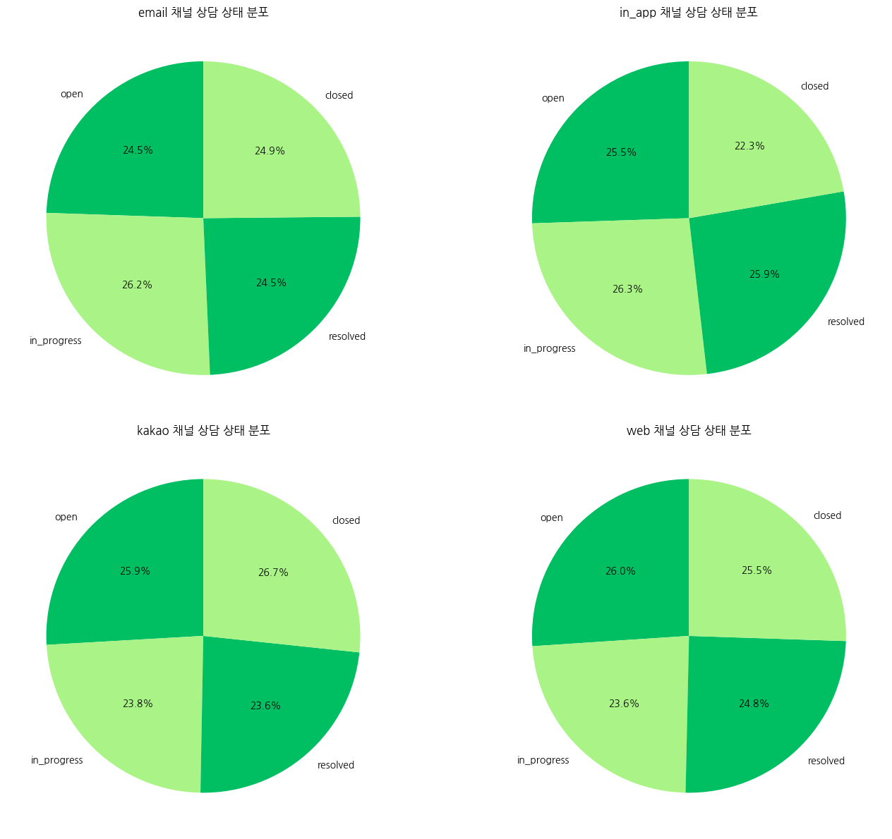

→ 색만 바꾸기

# 가설 5

: **6월에 유입 & 구독결제 증폭 → 왜?**

### A/B 테스트 시작 날짜 확인 → 시기 비슷 → 이용해도 좋듯

| **experiment_name** | 시작 날짜 | 끝난 날짜 |
| --- | --- | --- |
| checkout_design | 2025-07-01 04:47:34 | 2025-07-21 23:01:15 |
| onboarding_cta | 2025-06-01 01:42:52 | 2025-06-19 23:30:22 |
| pricing_ab | 2025-05-01 02:25:33 | 2025-05-30 22:56:35 |

### event_logs 월별 count 확인 → 유의미한 값없음

| event_timestamp | event_name | count |
| --- | --- | --- |
| 2024-12 | signup_completed | 976 |
| 2025-01 | signup_completed | 1018 |
| 2025-02 | signup_completed | 974 |
| 2025-03 | signup_completed | 32 |

| event_timestamp | event_name | count |
| --- | --- | --- |
| 2025-04 | lesson_played | 35524 |
|  | first_lesson_played | 12161 |
|  | page_viewed | 12156 |
|  | quiz_submitted | 10391 |
|  | course_searched | 7192 |
|  | first_quiz_submitted | 7108 |
|  | signup_completed | 2468 |
|  | pricing_page_viewed | 899 |
|  | course_wishlisted | 616 |
|  | payment_completed | 534 |
|  | push_sent | 532 |
|  | chat_sent | 260 |
|  | subscription_canceled | 34 |

| event_timestamp | event_name | count |
| --- | --- | --- |
| 2025-05 | lesson_played | 68063 |
|  | page_viewed | 23302 |
|  | first_lesson_played | 23291 |
|  | quiz_submitted | 19945 |
|  | course_searched | 13861 |
|  | first_quiz_submitted | 13625 |
|  | signup_completed | 4677 |
|  | pricing_page_viewed | 2145 |
|  | push_sent | 1208 |
|  | payment_completed | 1191 |
|  | course_wishlisted | 1155 |
|  | chat_sent | 430 |
|  | subscription_canceled | 59 |

| event_timestamp | event_name | count |
| --- | --- | --- |
| 2025-06 | lesson_played | 94626 |
|  | first_lesson_played | 32406 |
|  | page_viewed | 32366 |
|  | quiz_submitted | 27573 |
|  | course_searched | 19253 |
|  | first_quiz_submitted | 18937 |
|  | signup_completed | 6585 |
|  | pricing_page_viewed | 3051 |
|  | payment_completed | 1750 |
|  | course_wishlisted | 1594 |
|  | push_sent | 1566 |
|  | chat_sent | 625 |
|  | onboarding_cta_clicked | 343 |
|  | subscription_canceled | 83 |

| event_timestamp | event_name | count |
| --- | --- | --- |
| 2025-07 | lesson_played | 83005 |
|  | first_lesson_played | 28298 |
|  | page_viewed | 28214 |
|  | quiz_submitted | 24014 |
|  | course_searched | 16922 |
|  | first_quiz_submitted | 16702 |
|  | signup_completed | 5815 |
|  | pricing_page_viewed | 2688 |
|  | payment_completed | 1487 |
|  | course_wishlisted | 1427 |
|  | push_sent | 1399 |
|  | chat_sent | 563 |
|  | onboarding_cta_clicked | 159 |
|  | subscription_canceled | 72 |
|  | checkout_started | 15 |

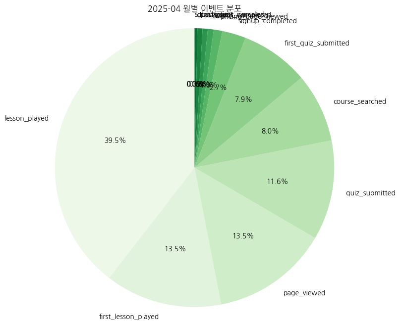

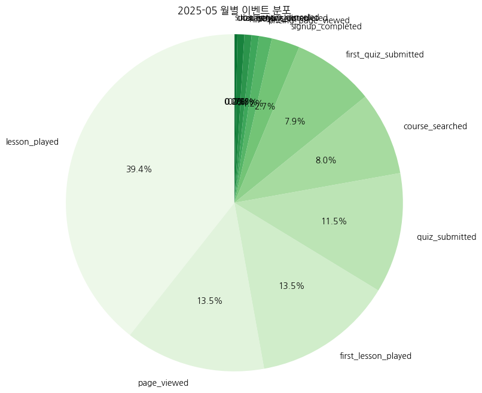

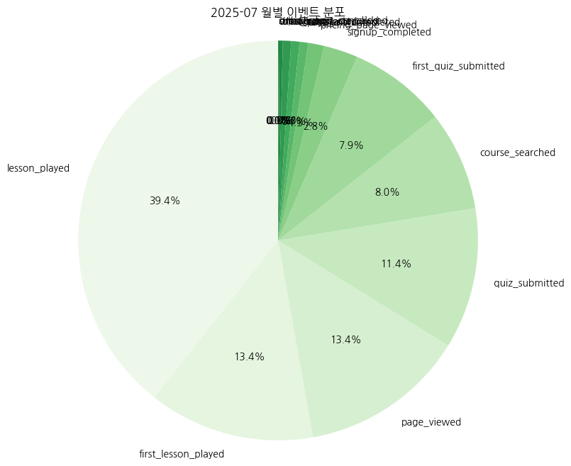

용혁

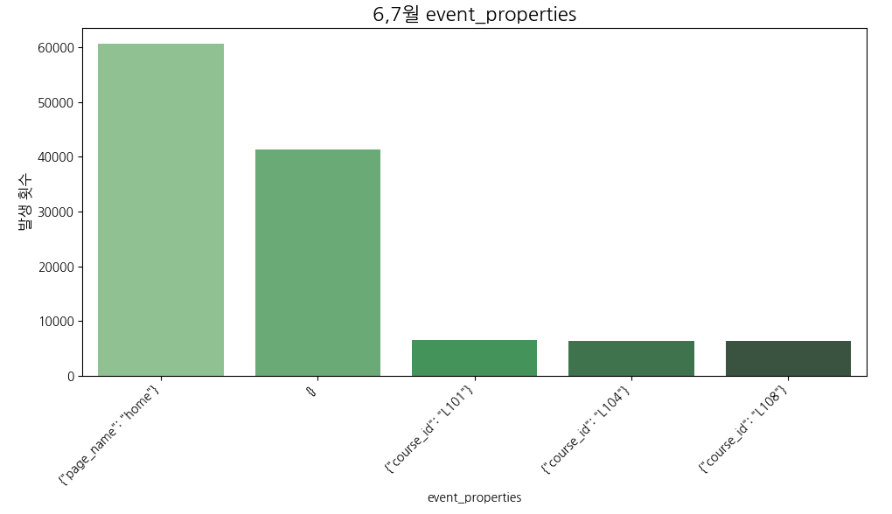

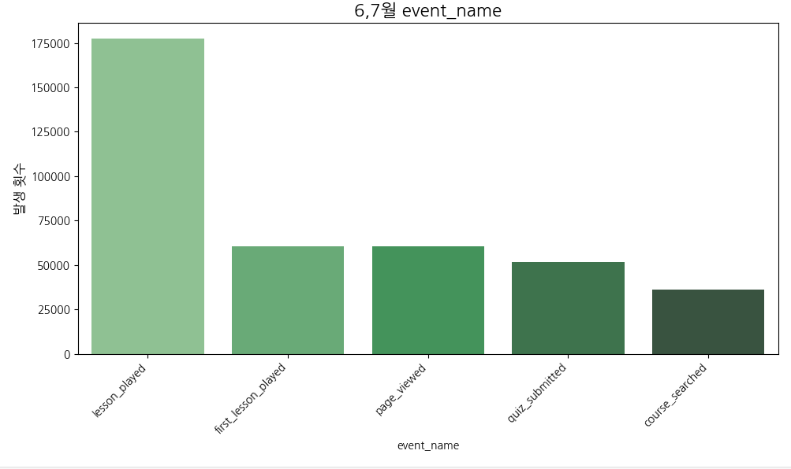

# 가설 6

**:무료체험 (및 강의) 에서 기기호환, 오류 문제의 개선 필요방안) 기술결함 개선**

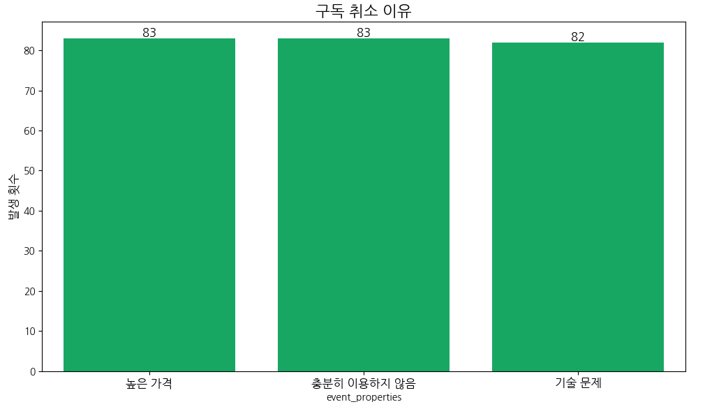

- 구독 취소 이유가 균등하게 나옴

## 방안

**: 기술결함 개선**