# 데이터 분석1

# 데이터 타입 확인 (unique, types, info)


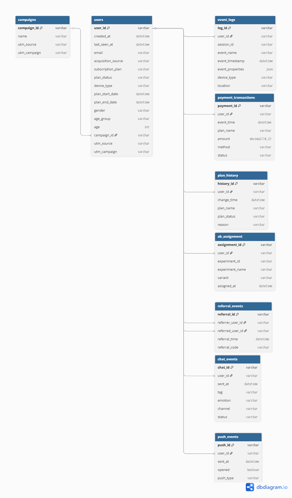


- 8/8 (금) 1차 데이터 분석 및 인사이트 요약
    - **users table** 확인 → 용혁, 유정
        - 타겟 파악: 구독상태 (none, trial) 인 유저 약 66% → 활성화 타겟군. 회원가입후 이탈? 무료체험후 이탈? 파악필요
        - 유저 현황 : 성별, 연령 다양 (20대>40대>10대)
        - 유입 경로 : 구글, 페북, 친추 다양 → ‘친구추천’ 마케팅 파악, 추천유입이 활성화로 연결되는가?
    - payment 확인 → 경현
        - 결제방식 : 대동소이, 간편결제율 높음
        - 결제성공 : 모두 성공, 결제시스템상 오류는 없음 → 결제 페이지내 결제를 망설이게 하는 요인 파악필요
        - 결제시기 : 6월 폭증 → 6월 결제 폭증 관련 캠페인 이벤트 확인 필요
    - refferal event 확인 → 정원
        - 친구 추천 : 약 2000명 → VIP 유저 혜택? 구독까지 이어지는 지 확인 필요
        - 전체 추천 건수: 2267건 (2059명이 추천)
        - 중복 추천 :
        
               3번 추천한 사람 수 → 16명
        
               2번 추천한 사람 수 → 176명
        
        - 시기 : 6~7월 폭증 → 관련 캠페인 이벤트 확인 필요 referral에서 유입 활성화까지 목표로 캠페인 데이터 연결확인
    - push event  확인 → 현근, 경현
        - Push 유형별 오픈율 : Reminder 알림 오픈률 낮음 (대동소이하나 system > promotion) 에 비해 낮은 오픈률
        - Push 알림 시기/타입별 : 6월 reminder > promotion , 7월 system > promotion → 6월 reminder 연결 가능?

- 8/11 (월) 빠진 데이터들 추가 분석
    - chat event → 경현
        - 전체 2125 → 전체 대비 문의 수 적음
        - 문의유형 : Complaint, Account, Payment, Feature Suggestion 위주 파악필요  → 활성화 지표
        - 문의채널 : web > app > kakao > email →  web, inapp 문의가 높다
        - 해결상태 : 카카오 해결률(resolved) 낮고, 미해결률(closed) 높음 → 카카오 채널 개선 필요
        - 문의 정서 : neutral 고객의 미해결률(closed) 높음.
    - plan history → 정원
        - trial to paid 등 구독변경 사유와 연결 필요
    - event log → 용혁, 유정
    - campaign → 경현
        - spring promo / referral / google CPC → 6월 캠페인 연결 가능할지 확인 필요, referral 로 유입 & 활성화 체크
    - ab assignment → TBD
        - 예측 : Pricing a/b test 명칭으로 보건데 ‘결제페이지 개선’ 테스트 였을 것이다
            
                        → event log로 (활성화 전) 유저의 이탈구간 확인후 관련한 데이터와 연결 필요 
            

# 의견

### Payment (경현)

### **전체 결제건 : 5667 건**

- **구독플랜 및 요금제 현황**
    - annual basic > monthly basic > monthly pro > annual pro
    - 인사이트 : 전체적으로 대동소이 하나 가격대가 저렴한 basic 플랜이 pro 플랜보다 수요가 높다. 또한, 월별 요금이 가장 저렴한 annual basic이 monthly basic보다 수요가 높았으며, pro의 경우 가격 부담으로 한달 찍먹 트라이를 위해 monthly_pro가 annual_pro보다 수요가 높았다.    ⇒ 피닉스는 가격에 민감하다.
    - 참고
    
    | **plan_name** | **amount** | **count** |
    | --- | --- | --- |
    | annual_basic | 99.99 | 1470 |
    | monthly_basic | 9.99 | 1417 |
    | monthly_pro | 19.99 | 1414 |
    | annual_pro | 199.99 | 1366 |

- **결제방식**
    - paypal> card > naver > toss > apple > kakao
    - 인사이트 : 균등한 분포지만, 간편결제가 전통결제 (paypal, card)보다 높다고 볼 수 있다.
    - 참고
    
    | **method** | **count** |
    | --- | --- |
    | paypal | 998 |
    | card | 961 |
    | naver | 958 |
    | toss | 956 |
    | apple | 910 |
    | kakao | 88 |
- **결제실패율**
    - 전체 성공

- **결제시기별 추이**
    - 6월 > 7월 > 5월 > 4월
    - 인사이트 : 6월 결제율이 아주 높기에, 6월에 구독결제관련 프로모션이 있었을 것으로 예상 (타데이터와 연결분석 필요)
    - 참고
    
    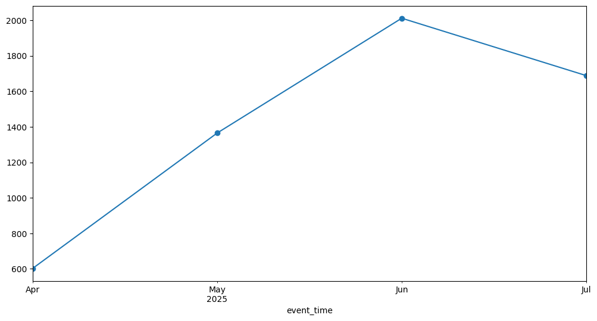

    
    | **event_time**
    **(Month)** | **count** |
    | --- | --- |
    | **2025-04** | 603 |
    | **2025-05** | 1365 |
    | **2025-06** | 2011 |
    | **2025-07** | 1688 |

### Push_Event(경현)

- 전체 : 5336 건
- Push 알림 시기/타입별 : 6월 reminder > promotion , 7월 system > promotion → 6월 reminder 한몫?

| **sent_at** | **promotion** | **reminder** | **system** |
| --- | --- | --- | --- |
| **2025-04** | 0.318865 | 0.322204 | 0.358932 |
| **2025-05** | 0.310015 | 0.340943 | 0.349043 |
| **2025-06** | 0.324100 | 0.354017 | 0.321884 |
| **2025-07** | 0.337992 | 0.322745 | 0.339263 |
|  |  |  |  |
- Push 알림 시기별 : 6 > 7 > 5월 순으로 높음 → 6월(유입, 결제 높은) 추적

| **sent_at** | **count** |  |
| --- | --- | --- |
| **2025-04** | 599 |  |
| **2025-05** | 1358 |  |
| **2025-06** | 1805 |  |
| **2025-07** | 1574 |  |

### Chat (경현)

- 전체 2125 → 전체 대비 문의수 적음
- 문의유형 : 활성화지표 연결되는 Complaint, Account, Payment, Feature Suggestion 위주 파악필요
- 문의채널 : web > app > kakao > email  (web, inapp 문의가 높다)
- 해결상태 : 해결률(resolved), 미결률(closed) 비교시, 카카오 해결률 낮고, 미결률 높음 → 카카오 채널 개선 필요
    
    ```
    # 문의 상태 해결률 (resolved) : inapp > web > email > kakao (앱,웹 해결도 높다. 카카오 해결률 낮음) 
    # 문의 상태 미결률 (closed) : kakao > web > email > inapp  (카카오, 웹에서 미해결종료 많음. 카카오 문제있음) 
    # closed는 해결불가하거나 시스템상 자동종료, 사용자 철회 등 예상  
    ```
    
- 문의 정서 : neutral 고객의 미해결률이 높음.

## users 유정

 

전체 고객 수 : 22545 명  

- **created_at**: 계정 생성(가입) 일시
- **last_seen_at**: 마지막 활동 일시

계정 생성이 마지막 활동인 고객 수 : 1856 (전체의 8%)

- **acquisition_source**: 가입 경로

| **acquisition_source** | **count** | **proportion** |  |
| --- | --- | --- | --- |
| **organic** | 4617 | 0.2 | 검색을 통해 자연스럽게 들어온 경우 |
| **google_cpc** | 4608 | 0.2 | 구글 광고 (cpc는 광고주가 클릭당 지불하는 비용) |
| **referral** | 4506 | 0.2 | 추천 |
| **facebook_ads** | 4431 | 0.2 | 페이스북  광고 |
| **direct** | 4383 | 0.19 | 이미 브랜드를 알고 있는 사용자가 직접 URL 주소창에 입력해서 들어오거나, 즐겨찾기를 통해 들어온 경우 |

- **subscription_plan**: 현재 구독 중인 요금제

| **subscription_plan** | **count** | **proportion** |
| --- | --- | --- |
| **none** | 14920 | 0.66 |
| **annual_basic** | 1948 | 0.09 |
| **monthly_basic** | 1926 | 0.09 |
| **monthly_pro** | 1896 | 0.08 |
| **annual_pro** | 1855 | 0.08 |

- **plan_status**: 현재 구독 상태

| **plan_status** | **count** | **proportion** |  |
| --- | --- | --- | --- |
| **none** | 10890 | 0.48 |  |
| **active** | 7174 | 0.32 |  |
| **trialing** | 4030 | 0.18 | 무료체험 |
| **canceled** | 451 | 0.02 |  |

- **device_type**: 가입 시 사용한 기기 종류

| **device_type** | **count** | **proportion** |
| --- | --- | --- |
| **web** | 7585 | 0.34 |
| **ios** | 7547 | 0.33 |
| **android** | 7413 | 0.33 |

- **gender**, **age_group**, **age**: 성별 및 연령 정보

| **age_group** | **count** | **proportion** |
| --- | --- | --- |
| **20s** | 3891 | 0.17 |
| **40s** | 3804 | 0.17 |
| **10s** | 3736 | 0.17 |
| **60s 이상** | 3725 | 0.17 |
| **50s** | 3713 | 0.16 |
| **30s** | 3676 | 0.16 |

| 60s | 616 |
| --- | --- |
| 70s | 618 |
| 80s | 596 |
| 90s | 613 |
| 100s | 632 |
| 110s | 603 |
| 120s | 47 |

- **campaign_id**, **utm_source**, **utm_campaign**: 가입 시 영향을 준 마케팅 캠페인 정보

| **campaign_id** | **count** | **proportion** | utm_source |
| --- | --- | --- | --- |
| **cmp_003** | 7672 | 0.34 | google |
| **cmp_001** | 7441 | 0.33 | facebook |
| **cmp_002** | 7432 | 0.33 | referral |

| **utm_campaign** | **count** | **proportion** |  |
| --- | --- | --- | --- |
| **sem24** | 7672 | 0.34 | (Searh Engine Marketing) 검색광고(유료광고)를 통해 진행하는 캠페인 |
| **spring24** | 7441 | 0.33 | 24년 봄 캠페인 |
| **ref_buddy** | 7432 | 0.33 | 친구추천 캠페인 |

## plan history(정원)
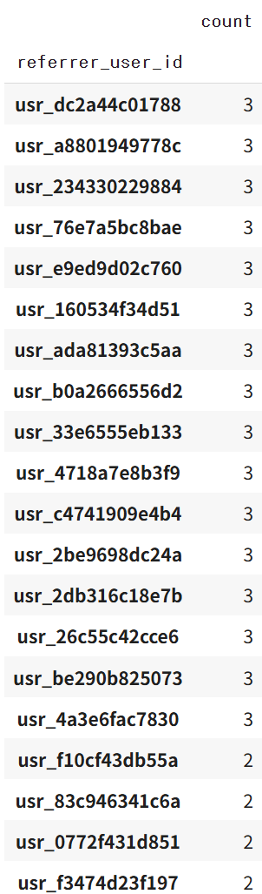

3번 추천한 user_id의 수: 16명


2번 추천한 user_id의 수: 176명

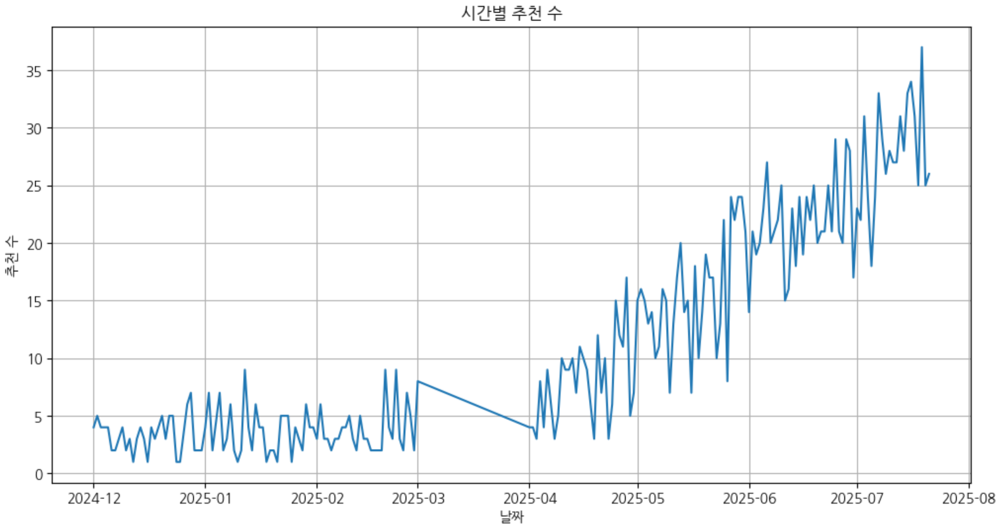

## Plan_history

|  | **count** |
| --- | --- |
| **change_time_month** | **reason** |
| **2024-12** | **existing_user** |
| **2025-01** | **existing_user** |
| **2025-02** | **existing_user** |
| **2025-03** | **existing_user** |
| **2025-04** | **signup** |
|  | **trial_expired** |
|  | **trial_to_paid** |
|  | **user_canceled** |
|  | **paid_signup** |
| **2025-05** | **signup** |
|  | **trial_expired** |
|  | **trial_to_paid** |
|  | **user_canceled** |
|  | **paid_signup** |
| **2025-06** | **signup** |
|  | **trial_expired** |
|  | **trial_to_paid** |
|  | **user_canceled** |
|  | **paid_signup** |
| **2025-07** | **signup** |
|  | **trial_expired** |
|  | **trial_to_paid** |
|  | **user_canceled** |
|  | **paid_signup** |

|  |  | **count** |
| --- | --- | --- |
| **change_time_month** | **plan_status** |  |
| **2024-12** | **active** | 605 |
|  | **trialing** | 178 |
|  | **none** | 138 |
|  | **canceled** | 55 |
| **2025-01** | **active** | 587 |
|  | **trialing** | 218 |
|  | **none** | 163 |
|  | **canceled** | 50 |
| **2025-02** | **active** | 585 |
|  | **trialing** | 199 |
|  | **none** | 133 |
|  | **canceled** | 57 |
| **2025-03** | **active** | 16 |
|  | **trialing** | 9 |
|  | **none** | 4 |
|  | **canceled** | 3 |
| **2025-04** | **trialing** | 2468 |
|  | **none** | 1098 |
|  | **active** | 603 |
|  | **canceled** | 44 |
| **2025-05** | **trialing** | 4677 |
|  | **none** | 2395 |
|  | **active** | 1365 |
|  | **canceled** | 64 |
| **2025-06** | **trialing** | 6585 |
|  | **none** | 3670 |
|  | **active** | 2011 |
|  | **canceled** | 97 |
| **2025-07** | **trialing** | 5815 |
|  | **none** | 3338 |
|  | **active** | 1688 |
|  | **canceled** | 81 |

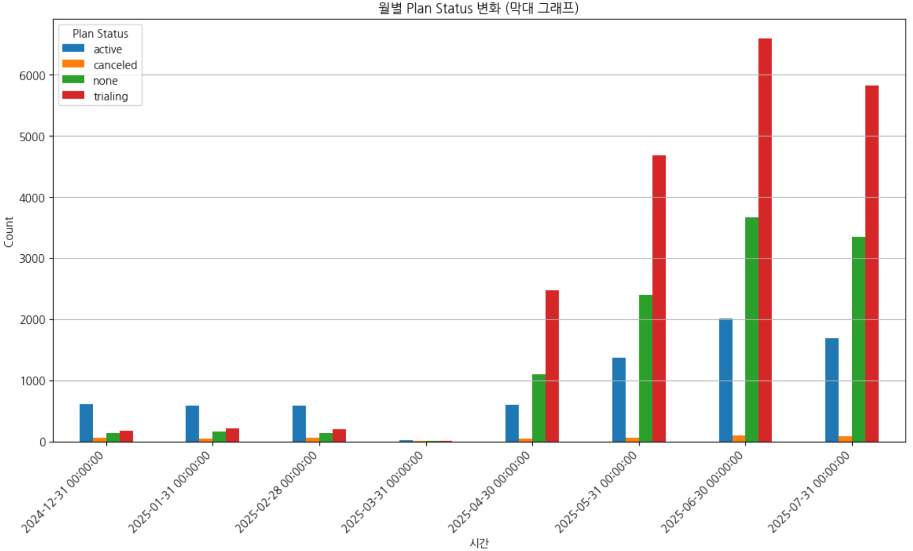

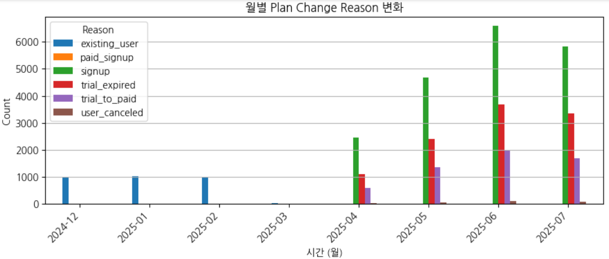


## 용혁

- 첫 접속이 마지막인 인원의 비율이 8.9%임

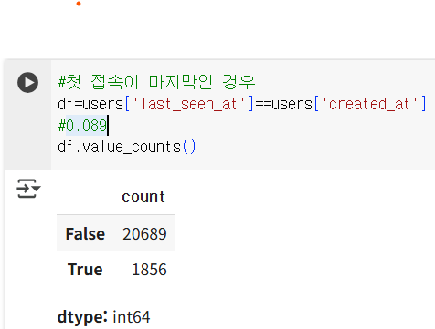

- 연령별 이용률

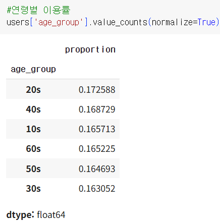

- 유입경로(?) → 회원 가입하면서 반드시 선택 해야 하는건가?

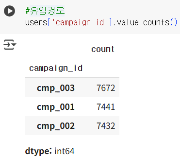

- 디바이스 타입 별 이용률 → 약 컴퓨터 33%, 핸드폰 67%

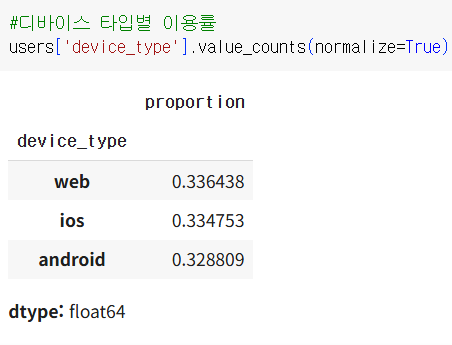

- 남녀 성비 → 거의 반반

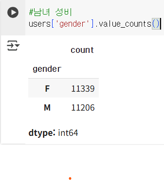

- 구독률 → 33.8%
- 일반적인 앱의 경우 회원가입으로 부터 구독까지 이어지는 경우는 2%초반

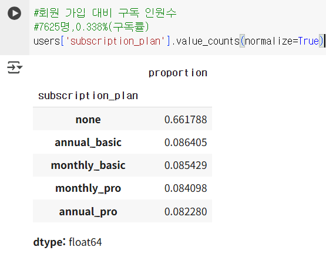

- 구독률 참고 → 우리의경우 3번에 해당하는 것 같습니다. 구독률 21%면 great로 표시되네요

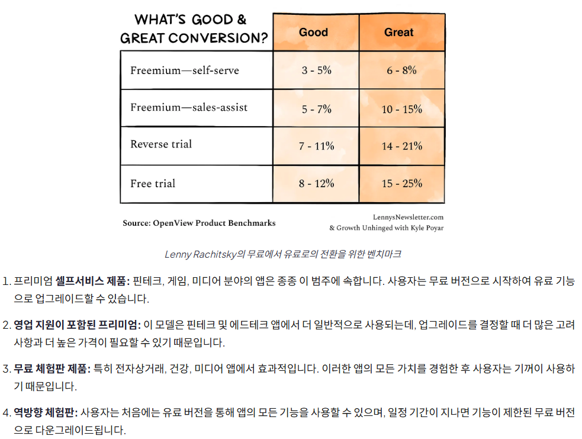

출처 https://www.plotline.so/blog/increase-free-to-paid-conversions-app

- **듀오링고(Duolingo)의 전환율**: 어학 교육 앱 시장의 선두주자인 듀오링고의 '월간 활성 사용자(MAU) 대비 유료 구독자 비율'은 2021년 2분기 기준으로 **5.1%**였습니다. 듀오링고의 CEO는 장기 목표로 **10%**를 제시했습니다. (출처: [purchasely.com](https://www.purchasely.com/blog/edtech-and-language-learning-insights-from-babbel-and-duolingo))
- **프리미엄 앱의 일반적인 전환율**: 프리미엄(Freemium) 모델을 사용하는 앱의 경우, 무료 사용자가 유료 사용자로 전환되는 비율이 **3~5%**면 양호한 수준, **6~8%**면 훌륭한 수준으로 평가됩니다. (출처: [plotline.so](https://www.plotline.so/blog/increase-free-to-paid-conversions-app))

- 유저 획득 경로
- organic 의 경우 직접 검색을 통해서 찾아오거나, 자연스럽게 발견해서 오는 경우라고 합니다.

## 현근

---

### event_logs 유정,용혁

- lesson_id(1~20) : 한 과목당 강의
- session_id → 한번 접속해서 종료할 때까지 한묶음


|인지/탐색 | 120,963 | page_viewed 96038 | onboarding_cta_clicked 502 | signup_completed 22545 | chat_sent 1878 |
| --- | --- | --- | --- | --- | --- |
| 고려 | 72,681 (60%) | course_searched 57228 | pricing_page_viewed 8783 | course_wishlisted 4792 | chat_sent 1878 |
| 전환 | 6,855 (9.4%) | checkout_started 15 | payment_completed 4962 |  | chat_sent
1878 |
| 유지 | 145,821 | course_searched 57228 | quiz_submitted 81923 | course_wishlisted 4792 | chat_sent 1878 |
| 이탈/재구독 | 6,831 | push_sent 4705 | subscription_canceled 248 |  | chat_sent 1878 |


| **event_name** | 단계정하기 | count | event_properties | 인사이트 |
| --- | --- | --- | --- | --- |
| lesson_played | X | 281218 | course_id (L101~L110): 과목 종류
lesson_id (1~20) : 한 과목 당 강의 | 미리보기 |
| first_lesson_played | X | 96156 | course_id (L101~L110): 과목 종류 | 본격적인 강의 시작 (중복 가능)
plan_history 와 연결해서 보기 → 무료체험?  |
| page_viewed | 인지/탐색 | 96038 | page_name : home 만 나옴 |  |
| quiz_submitted | 유지 | 81923 | quiz_id : course 값 (101~110), 
is_correct(정답) : false / true |  |
| course_searched | 고려 (강의 탐색 중 검색)
유지 (강의 중 검색) | 57228 | 라틴어 키워드 검색, 검색 결과 수 |  문법,독해 위주의 앱인가?
여러 코스 탐색 패턴 → 개인화된 학습 경로 필요로 보임 |
| first_quiz_submitted | X | 56372 | 값 없음 |  |
| signup_completed | 인지/탐색 | 22545 | 로그인 방법 (회원가입 완료)
naver :  5716   0.253537
email : 5697   0.252695
apple : 5666   0.251320
kakao : 5466   0.242448 |  |
| pricing_page_viewed | 고려 | 8783 | 값 없음 |  |
| payment_completed | 전환 | 4962 | 구독 이름 : annual / monthly, basic / pro
payment_id  |  |
| course_wishlisted | 고려 
유지 | 4792 | course_id (L101 ~ L110) |  |
| push_sent | 이탈/재구독 | 4705 | push_id |  |
| chat_sent | 전체 | 1878 | chat_id |  |
| onboarding_cta_clicked | 인지/탐색 | 502 | ab_variant
test : 258개
orginal : 244개 |  |
| subscription_canceled | 이탈/재구독 | 248 | 취소 이유
too_expensive : 83개
not_using_enough : 83개
technical_issues : 82개 |  |
| checkout_started | 전환 | 15 | ab_variant : redesign 15개 |  |
- plan history/ event log merge
    - 회원가입 하면 바로 trailing 상태로 바뀜

### a/b assignment

- test 3종류 : pricing(구독료페이지), onboarding cta(온보딩 버튼), checkout_deisgn(결제전 페이지)
    - **Onboarding**: 신규 사용자가 서비스에 처음 가입한 후 사용법을 익히고 적응하는 과정
    - **CTA (Call-to-Action)**: 사용자에게 특정 행동을 유도하는 버튼, 링크, 메시지
- event log 세션별 event에 2개 확인, pricing은 완료? → 각 A/B테스트로 활성화(구독전환)으로 이어지는가?

    | **experiment_name** | **count** |
    | --- | --- |
    | **pricing_ab** | 879 |
    | **onboarding_cta** | 407 |
    | **checkout_design** | 131 |

first_lesson_played

lesson_played 의 plan_status , reason 상태 체크

---

# 결과

### 데이터 분석

<aside>
📌

</aside>

### 인사이트 도출

<aside>
📌

</aside>

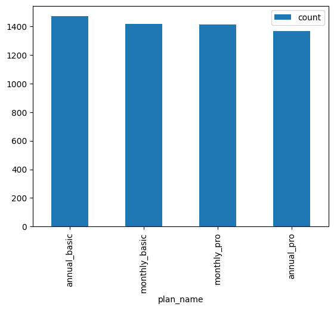

# 강사님 조언

- 앞단에서의 정리가 필요 할듯(명료화)
- 타겟의 구매력 포함, 확실히 정해야 될듯?
- 비즈니스 모델에서의 컨텐츠의 자세한 설명이 필요함
- 현황에서 비지니스를 피봇 하는건 어떨까?
- 데이터를 기반으로 비지니스를 바꾸는?
-